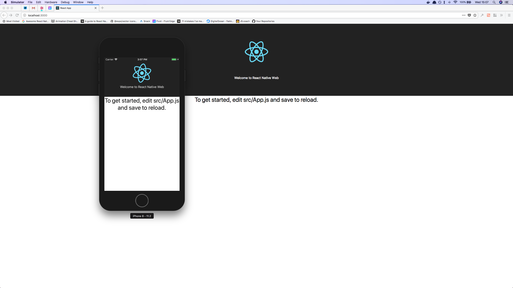

## React Native Web Starter

This repo is intending to provide an easy starting point for developers looking to make fully cross platform applications across both web with [React Native Web](https://github.com/necolas/react-native-web) and mobile with [Expo](https://github.com/react-community/create-react-native-app).

It is bootstrapped with [Create React App](https://github.com/facebook/create-react-app) so you can run `yarn web` in order to start up the development web server with all the hot reloading goodness you've come to expect.

It has then been integrated with [Create React Native App](https://github.com/react-community/create-react-native-app) and running `yarn ios` or `yarn android` will start the Expo packager. (You can also run the project from the Expo XDE program).

A full list of the scripts defined in `package.json` is shown below.
** TODO **

### Future Plans for this Library

The aim for this library is to make several branches that have different starting points i.e. Redux, Navigation, Auth etc.

Master branch will always be the most minimal starting point.

I'm also toying with the idea of doing a starting point with React Native CLI instead of Expo however that will mean the UI for mobile will less predictiable than developing with Expo.
